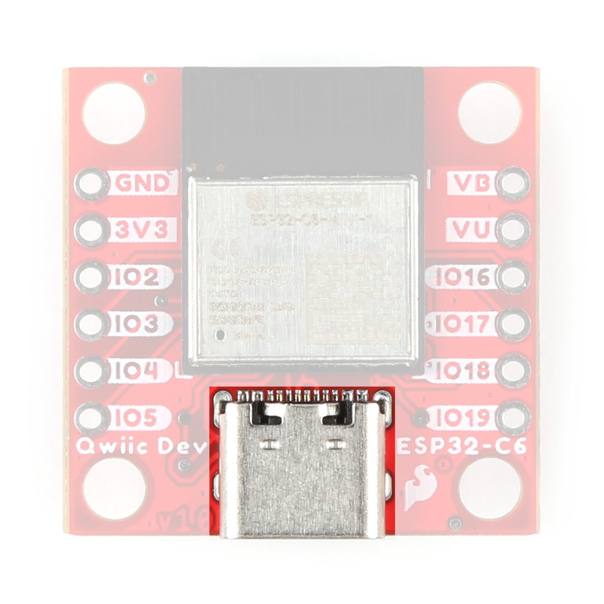
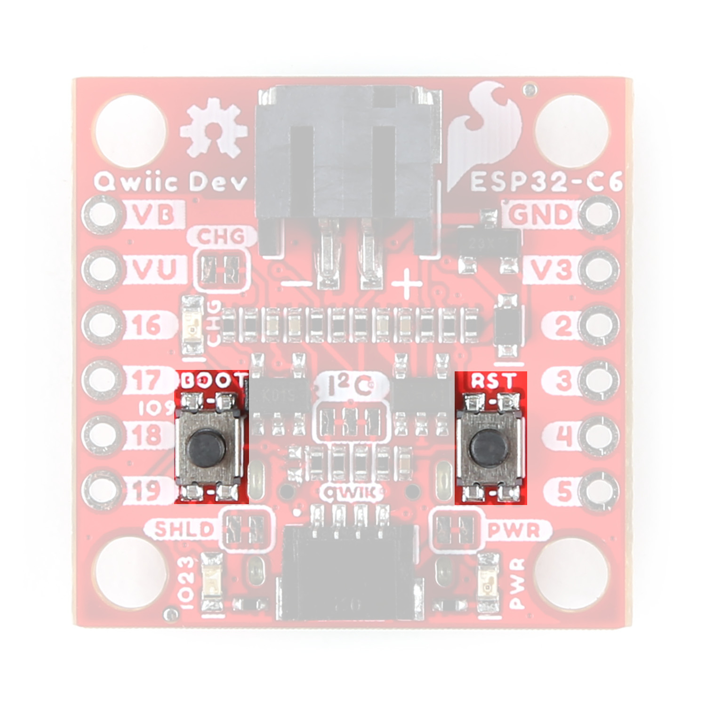
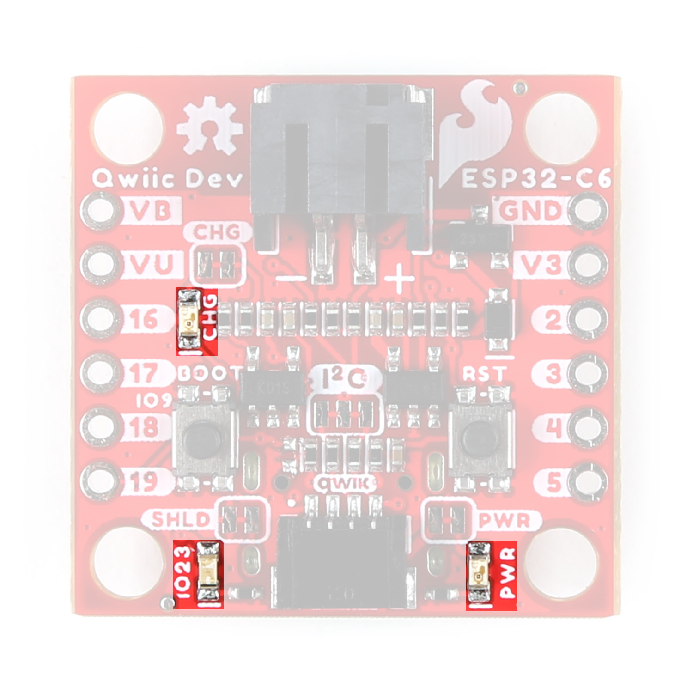
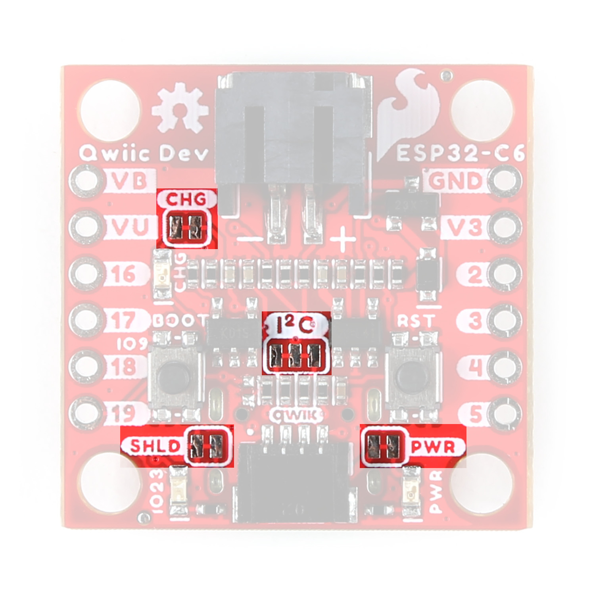
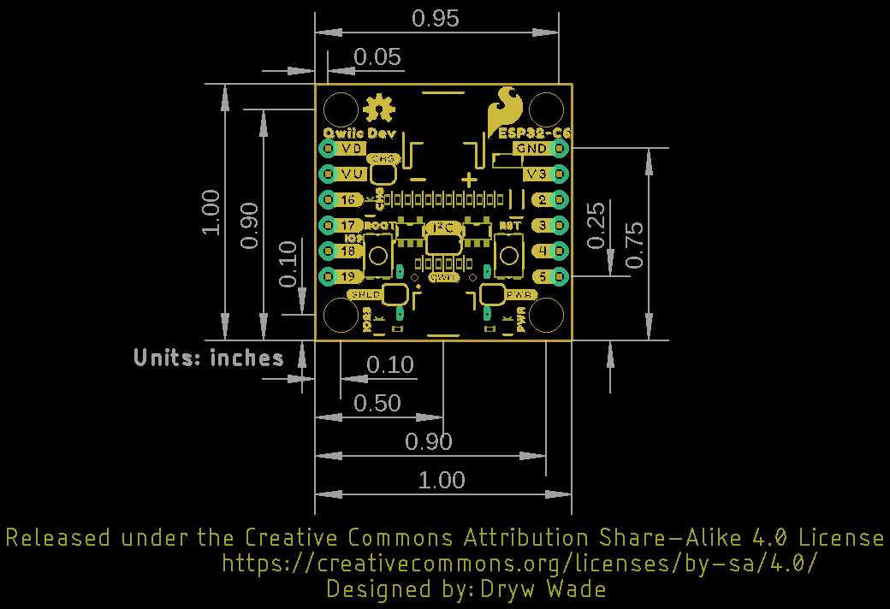

Let's take a closer look at the ESP32-C6 module and other hardware on the Qwiic Pocket Development Board.

## ESP32-C6 Mini-1 Module

The ESP32-C6 Mini-1 module from espressif features a 32-bit RISC-V single-core processor with an integrated wireless stack. The wireless stack is compatible with 2.4 GHz WiFi 6, Bluetooth&reg; 5.3, Zigbee and Thread (802.15.4) and uses an on-board PCB antenna.

<figure markdown>
[{ width="400"}](./assets/images/Pocket_Dev_ESP32-C6_Module.jpg "Click to enlarge")
</figure>

This development board uses the Mini version of the C6 module which has slightly less computing power in exchange for greater power efficiency. This makes this module perfect for battery-powered applications. The module features a wide range of peripheral options including SPI, UART, LPUART, I2C, I2S, LED PWM, USB Serial/JTAG controller, ADC and more. Many of these peripherals can be mapped to any GPIO pin though some are tied to specific pins. Refer to the [datasheet](./assets/component_documentation/ESP32-C6-MINI-1-Datasheet.pdf) for a complete overview of the ESP32-C6-MINI-1.

The ESP32-C6 has 4 MB Flash memory along with 512 KB SRAM (high power)/ 16 KB SRAM (low power). The module uses pin strapping to configure boot mode parameters. The board defaults to standard mode (GPIO 9 internal pull-up, all other strapping pins floating) but it can be set to other parameters by performing the following pin strapping:

- SDIO Sampling and Driving Clock Edge - MTMS & MTDI
- Chip Boot Mode - GPIO8 & GPIO9
- ROM Code Printing to UART - GPIO8
- JTAG Signal Source - GPIO15

## Power Components

### USB-C Connector

The USB-C connector on the board acts as the primary serial interface for the ESP32-C6 module as well as a power input. It connects directly to the ESP32-C6's USB serial converter. The <b>5V</b> USB input voltage is regulated down to <b>3.3V</b> through a voltage regulator with a max current of <b>500mA@3.3V</b>.

<figure markdown>
[{ width="400"}](./assets/images/Pocket_Dev_ESP32-USB.jpg "Click to enlarge")
</figure>

### JST Connector & Battery Charger

The board has a 2-pin JST connector to connect a single-cell Lithium Ion (LiPo) battery for battery-powered applications. It also has an MCP73831 battery charger to charge an attached battery. The charge rate is set to <b>214mA@3.3V</b>. The MCP73831 receives power from the V_USB line so it only is powered when <b>5V</b> is provided either over USB or the V_USB PTH pin. If applying voltage directly to the V_USB pin make sure it does not exceed <b>5.5V</b>.

<figure markdown>
[{ width="400"}](./assets/images/Pocket_Dev_ESP32-Battery.jpg "Click to enlarge")
</figure>

## Pinout & Qwiic Connector

### PTH Pins

The Qwiic Dev Board routes eight GPIO pins to a pair of 0.1"-spaced PTH headers. One side has <b>3.3V</b> and <b>GND</b> pins along with I/O pins 2, 3, 4, and 5. The other side has through-holes for <b>V_USB</b> and <b>VBatt</b> as well as I/O pins 16 (TX), 17 (RX), 18, and 19.

<figure markdown>
[{ width="400"}](./assets/images/Pocket_Dev_ESP32-Pinout.jpg "Click to enlarge")
</figure>

### Qwiic Connector

There's a Qwiic connector on the board tied to the ESP32-C6's Low Power I2C bus (I/O pins 6 and 7) for easy integration into SparkFun's Qwiic ecosystem. The Qwiic connector provides connections for SDA, SCL, 3.3V, and Ground.

<figure markdown>
[{ width="400"}](./assets/images/Pocket_Dev_ESP32-Qwiic.jpg "Click to enlarge")
</figure>

## Buttons

There are two buttons on the board labeled <b>RESET</b> and <b>BOOT</b>. The RESET button is tied to the ESP32-C6's Enable (EN) pin and resets the module when pressed. The BOOT button puts the ESP32-C6 into bootloader mode when held down during power on or reset.

<figure markdown>
[{ width="400"}](./assets/images/Pocket_Dev_ESP32-Buttons.jpg "Click to enlarge")
</figure>

## LEDs

The board has three LEDs labeled <b>PWR</b>, <b>STAT</b>, and <b>CHG</b>. The red Power (PWR) LED indicates whenever the <b>3.3V</b> circuit is powered. The blue Status (STAT) LED is tied to IO20 on the ESP32. The yellow Charge (CHG) LED indicates whenever the MCP73831 is charging a connected LiPo battery.

<figure markdown>
[{ width="400"}](./assets/images/Pocket_Dev_ESP32-LEDs.jpg "Click to enlarge")
</figure>

## Solder Jumpers

There are four solder jumpers on the Qwiic Dev Board labeled <b>CHG</b>, <b>I2C</b>, <b>SHLD</b>, and <b>PWR</b>. The table below outlines the jumpers' labels, default state, function, and any notes regarding their use:

<figure markdown>
[{ width="400"}](./assets/images/Pocket_Dev_ESP32-Jumpers.jpg "Click to enlarge")
</figure>

<table>
    <tr>
        <th>Label</th>
        <th>Default State</th>
        <th>Function</th>
        <th>Notes</th>
    </tr>
    <tr>
        <td>CHG</td>
        <td>CLOSED</td>
        <td>Completes Charge LED circuit</td>
        <td>Open to disable Charge LED</td>
    </tr>
    <tr>
        <td>I2C</td>
        <td>CLOSED</td>
        <td>Pulls the SDA/SCL lines to <b>3.3V</b> through a pair of <b>2.2k&ohm;</b> resistors</td>
        <td>Three-way jumper. Open completely to disable pullups</td>
    </tr>
    <tr>
        <td>SHLD</td>
        <td>CLOSED</td>
        <td>Ties the USB-C shield pin to the ground plane</td>
        <td>Open to isolate USB-C shield pin from the board's ground plane</td>
    </tr>
    <tr>
        <td>PWR</td>
        <td>CLOSED</td>
        <td>Completes the Power LED circuit</td>
        <td>Open to disable the Power LED</td>
    </tr>
</table>

## Board Dimensions

The Qwiic Dev Board - ESP32-C6 matches the 1" x 1" (22.6mm x 22.6mm) Qwiic form factor and has two mounting holes that fit a [4-40 screw](https://www.sparkfun.com/products/10453). 

<figure markdown>
[{ width="400"}](./assets/board_files/Qwiic_Pocket_Dev_ESP32_C6-Dimensions.png "Click to enlarge")
</figure>