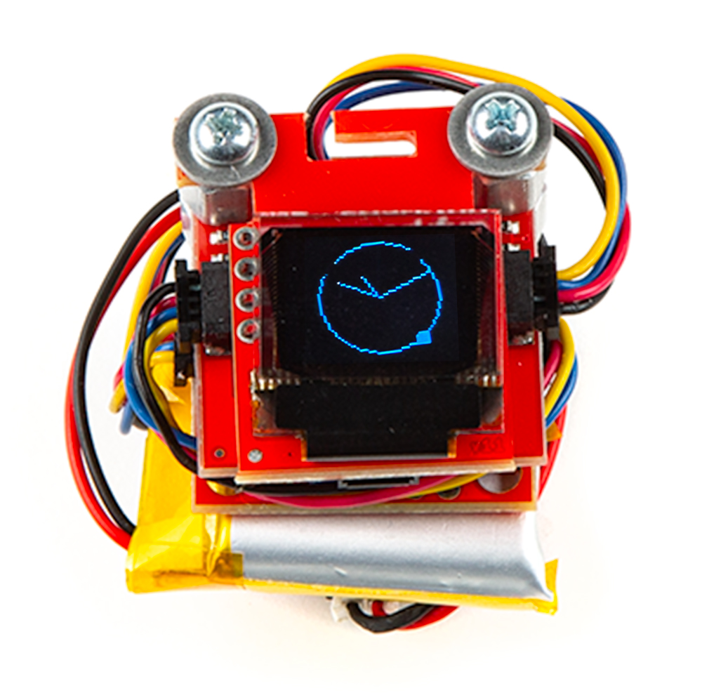

## Smart Watch Example Libraries

The smart watch demo requires three Arduino libraries for the three Qwiic breakouts used in it. Install the libraries through Arduino's Library Manager Tool by searching for the following: **"Micro OLED Breakout"**, **"SparkFun Qwiic RTC RV1805"**, and **"SparkFun BMI270"**. Users who prefer to install them manually can download ZIP folders of the libraries by clicking the buttons below:

<center>
[SparkFun Micro OLED Arduino Library (ZIP)](https://github.com/sparkfun/SparkFun_Micro_OLED_Arduino_Library/archive/refs/heads/main.zip){ .md-button .md-button--primary }
</center>

<center>
[SparkFun RV-1805 Arduino Library (ZIP)](https://github.com/sparkfun/SparkFun_RV-1805_Arduino_Library/archive/refs/heads/master.zip){ .md-button .md-button--primary }
</center>

<center>
[SparkFun BMI270 Arduino Library (ZIP)](https://github.com/sparkfun/SparkFun_BMI270_Arduino_Library/archive/refs/heads/main.zip){ .md-button .md-button--primary }
</center>

## Upload Demo Code

With the Qwiic Pocket Dev Board smart watch assembled, board definitions and libraries installed, we can upload the smart watch code to the Qwiic Pocket Development board. Copy the code below into a blank sketch or you can download it from the [GitHub repository](https://github.com/sparkfun/SparkFun_Qwiic_Pocket_Dev_Board_ESP32_C6/blob/main/Examples/WatchDemoC6.ino).

??? "Smart Watch Demo"
    ```
       
    --8<-- "https://raw.githubusercontent.com/sparkfun/SparkFun_Qwiic_Pocket_Dev_Board_ESP32_C6/main/Examples/WatchDemoC6.ino"
    ```

Now select the board (SparkFun ESP32-C6 Qwiic Pocket) and the Port and click the "Upload" button. Once the code finishes uploading, you should see a clock display on the Qwiic Micro OLED screen. 

## Code to Note

The code has a few settings users should take note of to get the most out of the smart watch demo. Let's take a closer look.

### BMA400 Settings

The code sets several thresholds on the BMA400 for tap/double-tap detection, step counting, and tilt-thresholds to fairly generous values to make all of the motion actions easy to trigger but some may find these to be too easily triggered. The code sets the BMA400's tap detection sensitivity to the max value (7) so if you want to make it less sensitive adjust this line:

```c++
.sensitivity = BMA400_TAP_SENSITIVITY_7,
```

### NTP Configuration

Syncing the RTC to a NTP (Network Time Protocol) server requires an internet connection. The code has placeholders for these values so you'll need to enter your network credentials in the section of code shown below:

```c++
const char* ssid = "your-ssid";
const char* password = "your-password";
```

## Smart Watch Actions

The smart watch code includes a bunch of motion-triggered actions to change the OLED display so let's take a closer look at them to make sure we get the most out of our smart watch.

### Deep Sleep Wake & Return

The code tells the circuit to enter deep sleep on two conditions: 60 seconds of inactivity or pressing the BOOT button on the bottom of the Qwiic Development Board. Double-tapping the watch wakes it from deep sleep and turns on the OLED to display the last screen viewed (default after upload is the analog clock).

### Tilt Functions

The OLED display is off by default to help conserve battery power. It enables the display when you're "checking your watch" so try tilting it in "towards" you with the OLED screen upright (ribbon cable on the bottom) and the display should turn on like the photo below:

<figure markdown>
[{ width="400"}](./assets/images/Smart_Watch_Assembly-Clock.jpg "Click to enlarge")
</figure>

Tilt the screen "away" to turn the screen back off. Otherwise, screen should return to deep sleep after 60 seconds of inactivity (ie. no tilts or taps).

### Tap Menu Options

When the OLED is active you can tap on the screen (or just trigger a tap action for the BMA400 like setting the watch down or a similar action) to cycle through the four display options: Clock, Step Counter, Battery Voltage, and Sync with NTP Server.

#### Analog Clock

This display is a simple analog clock interface without hour markings. It also features a nifty second counter signified by a dot travelling around the clock face.

<figure markdown>
[{ width="400"}](./assets/images/Smart_Watch_Assembly-Clock.jpg "Click to enlarge")
</figure>

#### Step Counter

The smart watch code also takes advantage of the BMA400's built-in step counting feature. It displays steps counted as well as the current action: Standing, Walking, and Running.

<figure markdown>
[{ width="400"}](./assets/images/Smart_Watch_Assembly-Pedometer.jpg "Click to enlarge")
</figure>

#### Battery Voltage

The third screen option shows the remaining battery voltage of a connected battery voltage to keep track of remaining charge on of an attached battery.

<figure markdown>
[{ width="400"}](./assets/images/Smart_Watch_Assembly-Battery.jpg "Click to enlarge")
</figure>

#### Sync with NTP Server

The last display option lets you remotely sync the RTC with an NTP (assuming it has a WiFi connection) by double-tapping the display when "Sync with NTP Server" is displayed.

<figure markdown>
[{ width="400"}](./assets/images/Smart_Watch_Assembly-NTP_Sync.jpg "Click to enlarge")
</figure>


