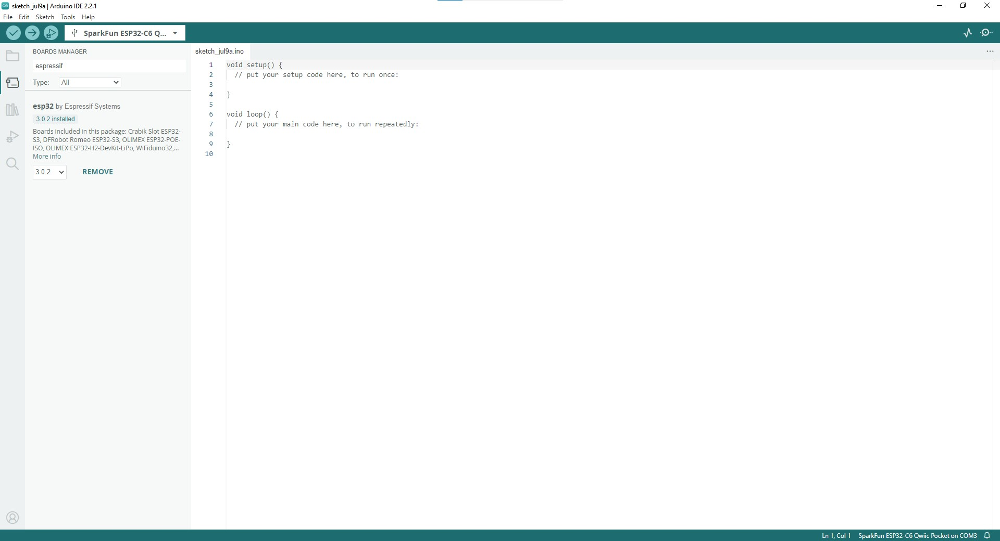

!!! attention
	If this is your first time using Arduino, please read through our tutorial on [installing the Arduino IDE](https://learn.sparkfun.com/tutorials/installing-arduino-ide). If you have not installed an Arduino library before, we recommend you check out our [installation guide](https://learn.sparkfun.com/tutorials/installing-an-arduino-library).

With the Qwiic Pocket Dev Board connected to our computer, it's time to set up the boards package in Arduino.

## Installing espressif Arduino Boards

The espressif ESP32 Arduino Boards package includes the Qwiic Pocket Development Board - ESP32-C6. Install it by opening the Boards Manager tab on the left side of the IDE, then search for "espressif ESP32" and install the latest version of the ESP32 boards package as the screenshot below shows. This assumes the use of Arduino 2.x and later. If you're on Legacy Arduino (1.8x and previous) can find the Boards Manager tool in File/Tools/Boards Manager.

<figure markdown>
[{ width="400"}](./assets/images/espressif_arduino_boards.jpg "Click to enlarge")
</figure>

## espressif IDF

Users who prefer to use espressif's development toolkit, espressif IDF, can get started by following their instructions [here](https://www.espressif.com/en/products/sdks/esp-idf) and  ESP32-C6 specific documentation [here](https://docs.espressif.com/projects/esp-idf/en/stable/esp32c6/index.html). 
